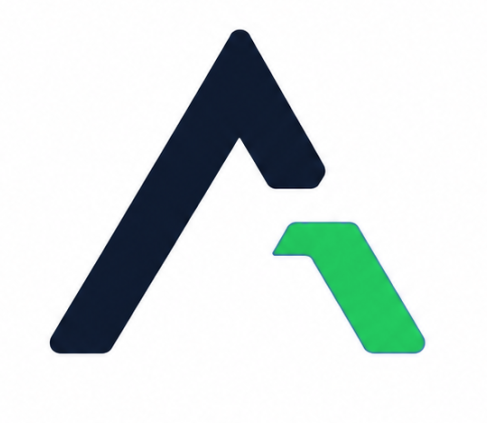
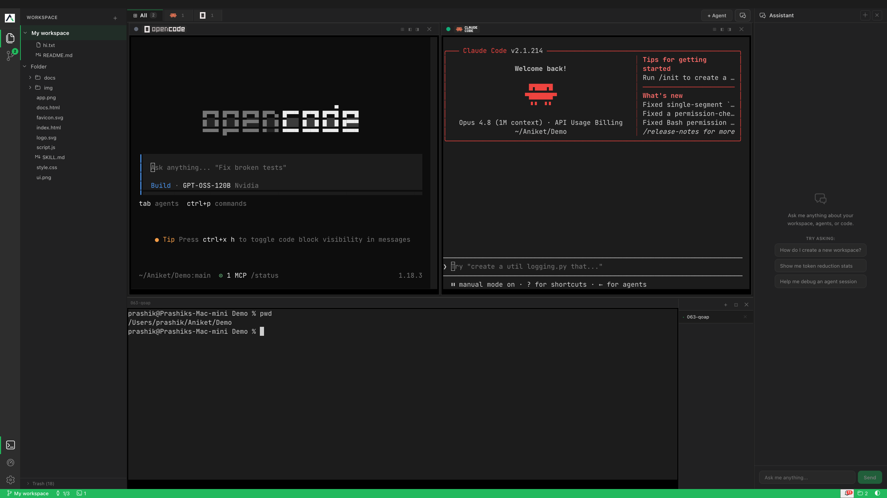
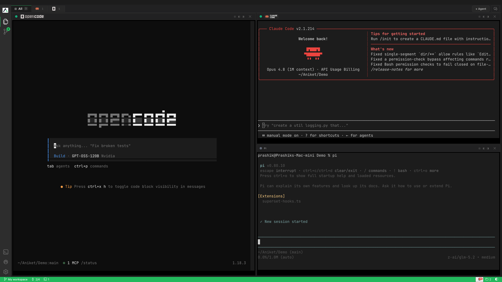
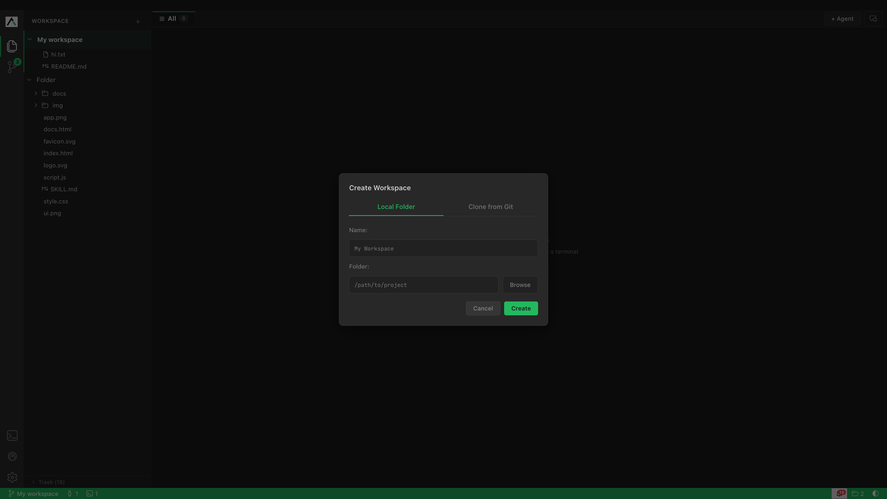
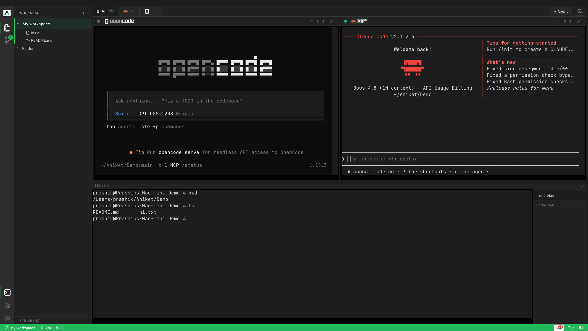

<h1 align="center">
  <a href="https://agntspce.dev"></a> AgntSpce
</h1>

<p align="center">
  Only Multi Agent Workspace IDE focused on<br/>
  <strong>cost efficiency, productivity & power!</strong>
</p>

<p align="center">
  Harness multiple coding agents all in single workspace<br/>
  with built in token reduction tools on each layer!
</p>

<p align="center">
  <a href="https://agntspce.dev"></a>
  <a href="LICENSE"></a>
  <a href="https://github.com/AniketWathore/agntspce/releases"></a>
  <a href="https://discord.gg/hcwQvggVR"></a>
  <a href="https://www.linkedin.com/company/agntspce"></a>
</p>

<h3 align="center"><a href="https://agntspce.dev/download"><ins>Download</ins></a> &nbsp;&bull;&nbsp; <a href="https://docs.agntspce.dev"><ins>Docs</ins></a></h3>

<p align="center">
  
</p>

> **Windows users:** Switch to the [`forWindows`](https://github.com/AniketWathore/agntspce/tree/forWindows) branch for Windows builds. Note that Windows builds may have issues — please [raise an issue](https://github.com/AniketWathore/agntspce/issues) if you encounter any problems.

---

## Why AgntSpce?

<table>
<tr>
<td width="33%" align="center" valign="top">

### Multi-Agent Execution

Run Claude Code, Codex, Opencode, and Gemini CLI simultaneously — each in its own isolated PTY-backed terminal. No tabs switching. No waiting.

</td>
<td width="33%" align="center" valign="top">

### Token Reduction Layers

Cut costs across every layer — command line output compression filters noise, semantic search indexes only what matters, and caveman skill strips all but essentials.

</td>
<td width="33%" align="center" valign="top">

### Worktree Orchestration

Each agent operates in its own isolated git worktree. Fan out tasks, compare results, and merge the winner — all without cross-contamination.

</td>
</tr>
</table>

---

## All Features

<table>
<tr>
<td width="50%" valign="middle">

### Parallel Agent Execution

Run Claude Code, Opencode, Codex, and Gemini CLI side-by-side. Each agent gets its own PTY-backed terminal with full session isolation.

</td>
<td width="50%">
  
</td>
</tr>
<tr>
<td width="50%" valign="middle">

### Workspace Management

Create, switch, and organize workspaces with persistent state. Full CRUD with trash/restore and permanent delete flows.

</td>
<td width="50%">
  
</td>
</tr>
<tr>
<td width="50%" valign="middle">

### Real-Time Terminal Streaming

Live terminal output streamed via Socket.IO into xterm.js panes. Status detection (idle, busy, waiting, exited) with instant UI updates.

</td>
<td width="50%">
  
</td>
</tr>
<tr>
<td width="50%" valign="middle">

### AgntSpce Output Compression

Built-in command line output compression powered by [RTK](https://github.com/rtk-ai/rtk) — filters redundant and low-information output to drastically reduce token consumption without losing context.

</td>
<td width="50%">
  
</td>
</tr>
<tr>
<td width="50%" valign="middle">

### AgntSpce Search MCP

Semantic code search via MCP protocol — index and search your entire codebase using [Semble](https://github.com/MinishLab/semble). Find relevant code instantly across any workspace.

</td>
<td width="50%">
  
</td>
</tr>
<tr>
<td width="50%" valign="middle">

### Git & Branch Tracking

Automatic branch detection, git worktree support, and diff review — all from within the app. Review changes without context switching.

</td>
<td width="50%">
  
</td>
</tr>
<tr>
<td width="50%" valign="middle">

### Built-in Code Editor

Monaco-powered code editor with syntax highlighting, file tree, and editor tabs. Open, edit, and save files without leaving AgntSpce.

</td>
<td width="50%">
  
</td>
</tr>
</table>

**Also in the box:**

- **[Shell terminals](https://docs.agntspce.dev/shell)** — Regular shell sessions alongside agent terminals in a collapsible sidebar.
- **[Dashboard & stats](https://docs.agntspce.dev/dashboard)** — Workspace/session counts, agent usage tracking, and compression metrics.
- **[Activity feed & notifications](https://docs.agntspce.dev/notifications)** — Real-time event log and unread state tracking.
- **[Commander palette](https://docs.agntspce.dev/commander)** — Cmd+K command palette for fast navigation.
- **[Caveman mode](https://docs.agntspce.dev/caveman)** — Minimalist panel for focused work.
- **And more** — we ship regularly. The [changelog](https://github.com/AniketWathore/agntspce/releases) is the real feature list.

---

## Requirements

| Requirement | Details |
|:------------|:--------|
| **OS** | macOS (primary), Windows, Linux |
| **Runtime** | Node.js 18+ |
| **Version Control** | Git 2.20+ |
| **Package Manager** | npm |

---

## Tech Stack

<p>
  <a href="https://www.electronjs.org/"></a>
  <a href="https://reactjs.org/"></a>
  <a href="https://www.typescriptlang.org/"></a>
  <a href="https://vitejs.dev/"></a>
  <a href="https://socket.io/"></a>
  <a href="https://expressjs.com/"></a>
  <a href="https://github.com/microsoft/node-pty"></a>
  <a href="https://xtermjs.org/"></a>
  <a href="https://microsoft.github.io/monaco-editor/"></a>
  <a href="https://www.npmjs.com/package/winston"></a>
</p>

---

## Installation

### Desktop App

```bash
# Clone the repository
git clone https://github.com/AniketWathore/agntspce.git
cd agntspce

# Install dependencies
npm install

# Run in development
npm run dev

# Package for production
npm run electron:build
```

### Download Prebuilt Binaries

- **[macOS](https://github.com/AniketWathore/agntspce/releases/latest)** — Apple Silicon & Intel
- **[Windows](https://github.com/AniketWathore/agntspce/tree/forWindows)** — See the `forWindows` branch
- **[Linux](https://github.com/AniketWathore/agntspce/releases/latest)** — AppImage *(Coming soon)*

> **⚠️ Windows Note:** Windows builds are available on the [`forWindows`](https://github.com/AniketWathore/agntspce/tree/forWindows) branch but may have issues. If you run into problems, please [open an issue](https://github.com/AniketWathore/agntspce/issues).

### Acknowledgment

AgntSpce is built on the shoulders of giants. We gratefully acknowledge the following open-source projects that power core features:

- **[Caveman](https://github.com/JuliusBrussee/caveman)** — Caveman mode panel for focused, distraction-free work.
- **[RTK](https://github.com/rtk-ai/rtk)** — Powers AgntSpce command line output compression and intelligent token reduction across every layer.
- **[Semble](https://github.com/MinishLab/semble)** — Semantic code indexing and search engine behind AgntSpce Search MCP.

These projects make AgntSpce more efficient, powerful, and intelligent. We are deeply grateful to their creators and communities.

---

## Community

Join the AgntSpce community to get help, share feedback, and connect with other users:

- **[Discord](https://discord.gg/hcwQvggVR)** — Chat with the team and community
- **[LinkedIn](https://www.linkedin.com/company/agntspce)** — Follow for updates and announcements
- **[GitHub Issues](https://github.com/AniketWathore/agntspce/issues)** — Report bugs and request features
- **[GitHub Discussions](https://github.com/AniketWathore/agntspce/discussions)** — Ask questions and share ideas

### Team

[]([https://linkedin.com/in/member1](https://www.linkedin.com/in/aniket-wathore-99a9ba248/))[]([https://linkedin.com/in/member2](https://www.linkedin.com/in/therohangaikwad/))[]([https://linkedin.com/in/member3](https://www.linkedin.com/in/prajwal-landge-b03729421/))

---

## License

Distributed under the **Apache 2.0 License**. See [`LICENSE`](LICENSE) for more information.
